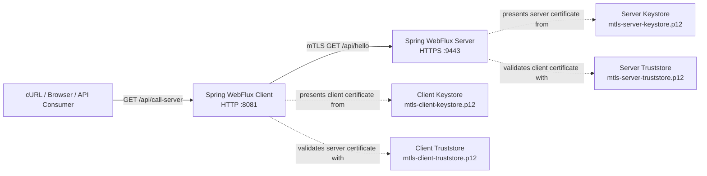

# Spring Boot 4.x Mutual TLS with WebFlux

This repository is a **Proof of Concept (PoC)** demonstrating Mutual TLS communication between two independent Spring Boot WebFlux applications:

- **mTLS Server** — exposes an HTTPS endpoint on port `9443` and requires a valid client certificate
- **mTLS Client** — exposes an HTTP endpoint on port `8081` and calls the server through an mTLS-enabled reactive `WebClient`

The project uses Spring Boot SSL Bundles with PKCS#12 keystores and truststores. Both applications authenticate each other during the TLS handshake:

- The client validates the server certificate
- The server validates the client certificate
- The client proves possession of the private key associated with its certificate
- HTTP communication begins only after both identities are successfully verified

> Mutual TLS authenticates both sides at the TLS layer. It does not replace application-level authorization such as OAuth 2.0, JWT, roles, permissions, or business access controls.

## Technology Stack

- Java 17
- Spring Boot 4.x
- Spring WebFlux
- Reactor Netty
- Spring Boot SSL Bundles
- Mutual TLS
- PKCS#12 keystores and truststores
- OpenSSL
- Java `keytool`

## Mutual TLS Concept

In regular One-Way TLS, only the server presents a certificate. In Mutual TLS, both the server and the client present certificates.

The simplified handshake is:

1. The client connects to the HTTPS server
2. The server sends its certificate chain
3. The client validates the server certificate using its truststore
4. The client verifies the server hostname against the certificate Subject Alternative Name
5. The server requests a client certificate
6. The client sends its certificate chain
7. The client uses its private key locally to prove possession of the certificate
8. The server validates the client certificate using its truststore
9. Both sides negotiate encrypted session keys
10. HTTP requests and responses are transmitted through the encrypted connection

The private keys are never transmitted over the network.

## Keystore and Truststore Responsibilities

| Application | Store | Purpose |
|---|---|---|
| mTLS Server | `mtls-server-keystore.p12` | Contains the server private key and server certificate chain |
| mTLS Server | `mtls-server-truststore.p12` | Contains trusted CA material used to validate client certificates |
| mTLS Client | `mtls-client-keystore.p12` | Contains the client private key and client certificate chain |
| mTLS Client | `mtls-client-truststore.p12` | Contains trusted CA material used to validate the server certificate |

A simple way to remember the difference:

- **Keystore** represents the application's own identity
- **Truststore** defines which remote identities the application trusts

## Architecture




## Repository Structure

```text
spring-boot-two-way-ssl/
├── certs/
│   ├── mtls-ca.crt
│   ├── mtls-ca.key
│   ├── mtls-ca.srl
│   ├── mtls-client-ext.cnf
│   ├── mtls-client-keystore.p12
│   ├── mtls-client-truststore.p12
│   ├── mtls-client.crt
│   ├── mtls-client.csr
│   ├── mtls-client.key
│   ├── mtls-server-ext.cnf
│   ├── mtls-server-keystore.p12
│   ├── mtls-server-truststore.p12
│   ├── mtls-server.crt
│   ├── mtls-server.csr
│   └── mtls-server.key
│
├── spring-two-way-ssl-client/
│   ├── pom.xml
│   └── src/
│       └── main/
│           ├── java/com/tirmizee/
│           │   ├── config/
│           │   │   └── WebClientConfig.java
│           │   ├── controller/
│           │   │   └── MutualTlsClientController.java
│           │   └── SpringTwoWaySslClientApplication.java
│           └── resources/
│               ├── application.yaml
│               └── certs/
│                   ├── mtls-client-keystore.p12
│                   └── mtls-client-truststore.p12
│
└── spring-two-way-ssl-server/
    ├── pom.xml
    └── src/
        └── main/
            ├── java/com/tirmizee/
            │   ├── controller/
            │   │   └── MutualTlsController.java
            │   └── SpringTwoWaySslServerApplication.java
            └── resources/
                ├── application.yaml
                └── certs/
                    ├── mtls-server-keystore.p12
                    └── mtls-server-truststore.p12
```

## Certificate Components

| File | Purpose |
|---|---|
| `mtls-ca.crt` | Public certificate of the local Certificate Authority |
| `mtls-ca.key` | Private key of the local Certificate Authority |
| `mtls-ca.srl` | Serial-number file created while signing certificates |
| `mtls-server.key` | Server private key |
| `mtls-server.csr` | Server Certificate Signing Request |
| `mtls-server.crt` | Server certificate signed by the local CA |
| `mtls-server-ext.cnf` | Server SAN, key-usage, and `serverAuth` extensions |
| `mtls-server-keystore.p12` | Server private key and certificate chain |
| `mtls-server-truststore.p12` | Trusted CA used by the server to validate client certificates |
| `mtls-client.key` | Client private key |
| `mtls-client.csr` | Client Certificate Signing Request |
| `mtls-client.crt` | Client certificate signed by the local CA |
| `mtls-client-ext.cnf` | Client key-usage and `clientAuth` extensions |
| `mtls-client-keystore.p12` | Client private key and certificate chain |
| `mtls-client-truststore.p12` | Trusted CA used by the client to validate the server certificate |

> **Security warning:** The certificates, private keys, passwords, and stores included in this repository are intended for local development only. Never reuse them in production or commit production private keys to source control.

## Prerequisites

- JDK 17 or later
- OpenSSL
- Java `keytool`
- A terminal capable of running the Maven Wrapper

Verify Java:

```bash
java -version
```

Verify OpenSSL:

```bash
openssl version
```

Verify `keytool`:

```bash
keytool -help
```

## Quick Start

The repository already contains development certificates and PKCS#12 stores. New certificates do not need to be generated before running the PoC.

### 1. Start the mTLS Server

Open the first terminal:

```bash
cd spring-two-way-ssl-server
./mvnw clean spring-boot:run
```

The server starts at:

```text
https://localhost:9443
```

The server requires a trusted client certificate because the following configuration is enabled:

```yaml
server:
  ssl:
    client-auth: need
```

### 2. Start the mTLS Client

Open the second terminal:

```bash
cd spring-two-way-ssl-client
./mvnw clean spring-boot:run
```

The client starts at:

```text
http://localhost:8081
```

### 3. Test the End-to-End Flow

Call the client application:

```bash
curl http://localhost:8081/api/call-server
```

Expected response:

```json
{
  "message": "Hello from Mutual TLS Server",
  "clientCertificateSubject": "CN=mtls-client"
}
```

The Spring WebFlux client performs the mTLS handshake with the server and forwards the server response to the caller.

### 4. Test the mTLS Server Directly

Run the following command from the repository root:

```bash
curl \
  --cacert certs/mtls-ca.crt \
  --cert certs/mtls-client.crt \
  --key certs/mtls-client.key \
  https://localhost:9443/api/hello
```

The command provides:

- `--cacert` to validate the server certificate
- `--cert` to present the client certificate
- `--key` to prove possession of the client private key

Expected response:

```json
{
  "message": "Hello from Mutual TLS Server",
  "clientCertificateSubject": "CN=mtls-client"
}
```

### 5. Verify That the Client Certificate Is Required

Call the server without a client certificate:

```bash
curl \
  --cacert certs/mtls-ca.crt \
  https://localhost:9443/api/hello
```

The TLS handshake should fail because the server is configured with:

```yaml
client-auth: need
```

Do not use the following command as proof that certificate validation works:

```bash
curl -k https://localhost:9443/api/hello
```

The `-k` option disables server certificate verification and bypasses an important part of the TLS trust model.

## Server-Side SSL Configuration

The server uses the `mtls-server` SSL Bundle for both server identity and client certificate validation.

`spring-two-way-ssl-server/src/main/resources/application.yaml`

```yaml
server:
  port: 9443
  ssl:
    enabled: true
    bundle: mtls-server
    client-auth: need

spring:
  application:
    name: spring-two-way-ssl-server

  ssl:
    bundle:
      jks:
        mtls-server:
          key:
            alias: mtls-server
          keystore:
            location: classpath:certs/mtls-server-keystore.p12
            password: changeit
            type: PKCS12
          truststore:
            location: classpath:certs/mtls-server-truststore.p12
            password: changeit
            type: PKCS12
```

The server SSL Bundle contains:

- Server private key
- Server certificate
- Server certificate chain
- Trusted CA material for validating client certificates
- Private-key alias `mtls-server`

Although the configuration namespace is named `jks`, Spring Boot also supports PKCS#12 stores through this bundle type.

### Client Authentication Modes

Spring Boot supports different client authentication modes:

| Value | Behavior |
|---|---|
| `none` | The server does not request a client certificate |
| `want` | The server requests a client certificate but permits clients without one |
| `need` | The server requires a trusted client certificate |

This project uses `need`, which makes client certificate authentication mandatory.

## Client-Side SSL Configuration

The client uses the `mtls-client` SSL Bundle to:

- Present its client certificate to the server
- Prove possession of its private key
- Validate the server certificate

`spring-two-way-ssl-client/src/main/resources/application.yaml`

```yaml
server:
  port: 8081

secure-server:
  base-url: https://localhost:9443
  ssl-bundle: mtls-client

spring:
  ssl:
    bundle:
      jks:
        mtls-client:
          key:
            alias: mtls-client
          keystore:
            location: classpath:certs/mtls-client-keystore.p12
            password: changeit
            type: PKCS12
          truststore:
            location: classpath:certs/mtls-client-truststore.p12
            password: changeit
            type: PKCS12
```

Unlike a One-Way TLS client, an mTLS client requires both:

- A **keystore** containing its private key and certificate chain
- A **truststore** containing the trusted CA used to validate the server

## Reactor Netty WebClient Configuration

Spring Boot exposes configured SSL material through `SslBundles`.

The client retrieves the configured bundle and uses its `KeyManagerFactory` and `TrustManagerFactory` to build a Netty-compatible `SslContext`.

`spring-two-way-ssl-client/src/main/java/com/tirmizee/config/WebClientConfig.java`

```java
package com.tirmizee.config;

import io.netty.handler.ssl.SslContextBuilder;
import org.springframework.beans.factory.annotation.Value;
import org.springframework.boot.ssl.SslBundles;
import org.springframework.context.annotation.Bean;
import org.springframework.context.annotation.Configuration;
import org.springframework.http.client.reactive.ReactorClientHttpConnector;
import org.springframework.web.reactive.function.client.WebClient;
import reactor.netty.http.client.HttpClient;

import javax.net.ssl.SSLException;
import java.util.Arrays;

@Configuration
public class WebClientConfig {

    @Value("${secure-server.base-url}")
    private String baseUrl;

    @Value("${secure-server.ssl-bundle}")
    private String sslBundleName;

    @Bean
    public WebClient mutualTlsWebClient(SslBundles sslBundles) throws SSLException {
        var sslBundle = sslBundles.getBundle(sslBundleName);
        var sslBundleOptions = sslBundle.getOptions();
        var sslManagers = sslBundle.getManagers();

        var sslContextBuilder = SslContextBuilder.forClient()
                .keyManager(sslManagers.getKeyManagerFactory())
                .trustManager(sslManagers.getTrustManagerFactory());

        if (sslBundleOptions.getEnabledProtocols() != null) {
            sslContextBuilder.protocols(
                    sslBundleOptions.getEnabledProtocols()
            );
        }

        if (sslBundleOptions.getCiphers() != null) {
            sslContextBuilder.ciphers(
                    Arrays.stream(sslBundleOptions.getCiphers()).toList()
            );
        }

        var nettySslContext = sslContextBuilder.build();

        var httpClient = HttpClient.create()
                .secure(sslContextSpec ->
                        sslContextSpec.sslContext(nettySslContext)
                );

        return WebClient.builder()
                .baseUrl(baseUrl)
                .clientConnector(
                        new ReactorClientHttpConnector(httpClient)
                )
                .build();
    }
}
```

### Key Manager and Trust Manager

The two manager factories have different responsibilities:

```java
.keyManager(sslManagers.getKeyManagerFactory())
```

The Key Manager selects the client certificate and private key that will be used during the mTLS handshake.

```java
.trustManager(sslManagers.getTrustManagerFactory())
```

The Trust Manager validates the certificate chain presented by the server.

Both are required for this mTLS client.

### Why a Netty SslContext Is Built Manually

`SslBundle#createSslContext()` creates a JDK `javax.net.ssl.SSLContext`.

The low-level Reactor Netty configuration used by this project accepts Netty's:

```java
io.netty.handler.ssl.SslContext
```

The application therefore obtains the key and trust manager factories from the Spring Boot SSL Bundle and supplies them to Netty's `SslContextBuilder`.

### Null-Safe Protocol and Cipher Configuration

Protocols and cipher suites are optional SSL Bundle settings. Their values may be `null` when they are not explicitly configured.

The application checks each value before applying it:

```java
if (sslBundleOptions.getEnabledProtocols() != null) {
    sslContextBuilder.protocols(
            sslBundleOptions.getEnabledProtocols()
    );
}

if (sslBundleOptions.getCiphers() != null) {
    sslContextBuilder.ciphers(
            Arrays.stream(sslBundleOptions.getCiphers()).toList()
    );
}
```

When these settings are absent, Reactor Netty uses the supported defaults of the selected SSL provider.

## Reading the Client Certificate on the Server

After a successful mTLS handshake, Spring WebFlux exposes TLS information through `ServerWebExchange`.

The server reads the peer certificate from `SslInfo`:

```java
private String getClientCertificateSubject(
        ServerWebExchange exchange
) {
    return Optional
            .ofNullable(exchange.getRequest().getSslInfo())
            .map(SslInfo::getPeerCertificates)
            .filter(certificates -> certificates.length > 0)
            .map(certificates -> certificates[0])
            .map(this::getSubject)
            .orElse("not-present");
}
```

The first peer certificate normally represents the client leaf certificate.

Its subject is returned in the API response:

```java
response.put(
        "clientCertificateSubject",
        getClientCertificateSubject(exchange)
);
```

> Reading a certificate subject demonstrates that the client certificate is available to the application. Production authorization should use stable certificate attributes and an explicit identity-mapping policy rather than trusting an arbitrary subject string.

## API Endpoints

### mTLS Server

```http
GET https://localhost:9443/api/hello
```

A valid client certificate is required.

Response:

```json
{
  "message": "Hello from Mutual TLS Server",
  "clientCertificateSubject": "CN=mtls-client"
}
```

### mTLS Client

```http
GET http://localhost:8081/api/call-server
```

The client calls the mTLS server through its configured reactive `WebClient` and returns the server response.

## Generate New Development Certificates

The following commands recreate the certificate model used by this repository:

```text
Local Certificate Authority
├── signs Server Certificate
└── signs Client Certificate
```

Run the commands from the repository root.

### 1. Create the Local Certificate Authority

```bash
mkdir -p certs
cd certs
```

Generate the CA private key:

```bash
openssl genrsa \
  -out mtls-ca.key \
  4096
```

Generate the CA certificate:

```bash
openssl req \
  -x509 \
  -new \
  -sha256 \
  -days 3650 \
  -key mtls-ca.key \
  -out mtls-ca.crt \
  -subj "/CN=Mutual TLS Demo Root CA"
```

### 2. Create the Server Private Key and CSR

```bash
openssl genrsa \
  -out mtls-server.key \
  2048
```

```bash
openssl req \
  -new \
  -sha256 \
  -key mtls-server.key \
  -out mtls-server.csr \
  -subj "/CN=localhost"
```

### 3. Configure Server Certificate Extensions

Create `mtls-server-ext.cnf`:

```text
subjectAltName=DNS:localhost,IP:127.0.0.1
extendedKeyUsage=serverAuth
keyUsage=digitalSignature,keyEncipherment
```

The Subject Alternative Name is required for hostname verification.

The certificate supports:

- `localhost`
- `127.0.0.1`

### 4. Sign the Server Certificate

```bash
openssl x509 \
  -req \
  -sha256 \
  -days 825 \
  -in mtls-server.csr \
  -CA mtls-ca.crt \
  -CAkey mtls-ca.key \
  -CAcreateserial \
  -out mtls-server.crt \
  -extfile mtls-server-ext.cnf
```

### 5. Create the Client Private Key and CSR

```bash
openssl genrsa \
  -out mtls-client.key \
  2048
```

```bash
openssl req \
  -new \
  -sha256 \
  -key mtls-client.key \
  -out mtls-client.csr \
  -subj "/CN=mtls-client"
```

### 6. Configure Client Certificate Extensions

Create `mtls-client-ext.cnf`:

```text
extendedKeyUsage=clientAuth
keyUsage=digitalSignature
```

The `clientAuth` Extended Key Usage indicates that the certificate is intended for TLS client authentication.

### 7. Sign the Client Certificate

```bash
openssl x509 \
  -req \
  -sha256 \
  -days 825 \
  -in mtls-client.csr \
  -CA mtls-ca.crt \
  -CAkey mtls-ca.key \
  -CAserial mtls-ca.srl \
  -out mtls-client.crt \
  -extfile mtls-client-ext.cnf
```

### 8. Create the Server PKCS#12 Keystore

```bash
openssl pkcs12 \
  -export \
  -name mtls-server \
  -inkey mtls-server.key \
  -in mtls-server.crt \
  -certfile mtls-ca.crt \
  -out mtls-server-keystore.p12 \
  -passout pass:changeit
```

The alias must match the server configuration:

```yaml
key:
  alias: mtls-server
```

### 9. Create the Client PKCS#12 Keystore

```bash
openssl pkcs12 \
  -export \
  -name mtls-client \
  -inkey mtls-client.key \
  -in mtls-client.crt \
  -certfile mtls-ca.crt \
  -out mtls-client-keystore.p12 \
  -passout pass:changeit
```

The alias must match the client configuration:

```yaml
key:
  alias: mtls-client
```

### 10. Create the Client Truststore

The client truststore contains the CA certificate used to validate the server certificate:

```bash
keytool \
  -importcert \
  -noprompt \
  -alias mtls-ca \
  -file mtls-ca.crt \
  -keystore mtls-client-truststore.p12 \
  -storetype PKCS12 \
  -storepass changeit
```

### 11. Create the Server Truststore

The server truststore contains the CA certificate used to validate client certificates:

```bash
keytool \
  -importcert \
  -noprompt \
  -alias mtls-ca \
  -file mtls-ca.crt \
  -keystore mtls-server-truststore.p12 \
  -storetype PKCS12 \
  -storepass changeit
```

Because the same local CA signs both certificates in this PoC, both truststores contain the same CA certificate.

Production systems may use separate server and client CAs.

### 12. Copy the Stores into the Applications

From the `certs` directory:

```bash
cp mtls-server-keystore.p12 \
  ../spring-two-way-ssl-server/src/main/resources/certs/

cp mtls-server-truststore.p12 \
  ../spring-two-way-ssl-server/src/main/resources/certs/

cp mtls-client-keystore.p12 \
  ../spring-two-way-ssl-client/src/main/resources/certs/

cp mtls-client-truststore.p12 \
  ../spring-two-way-ssl-client/src/main/resources/certs/
```

Restart both applications after replacing the stores.

## Inspect the Generated Certificates

### Inspect the Server Certificate

```bash
openssl x509 \
  -in certs/mtls-server.crt \
  -noout \
  -subject \
  -issuer \
  -dates \
  -ext subjectAltName \
  -ext extendedKeyUsage
```

### Inspect the Client Certificate

```bash
openssl x509 \
  -in certs/mtls-client.crt \
  -noout \
  -subject \
  -issuer \
  -dates \
  -ext extendedKeyUsage
```

### Verify the Server Certificate

```bash
openssl verify \
  -CAfile certs/mtls-ca.crt \
  certs/mtls-server.crt
```

Expected result:

```text
certs/mtls-server.crt: OK
```

### Verify the Client Certificate

```bash
openssl verify \
  -CAfile certs/mtls-ca.crt \
  certs/mtls-client.crt
```

Expected result:

```text
certs/mtls-client.crt: OK
```

### Inspect the Server Keystore

```bash
keytool \
  -list \
  -v \
  -storetype PKCS12 \
  -keystore spring-two-way-ssl-server/src/main/resources/certs/mtls-server-keystore.p12 \
  -storepass changeit
```

### Inspect the Server Truststore

```bash
keytool \
  -list \
  -v \
  -storetype PKCS12 \
  -keystore spring-two-way-ssl-server/src/main/resources/certs/mtls-server-truststore.p12 \
  -storepass changeit
```

### Inspect the Client Keystore

```bash
keytool \
  -list \
  -v \
  -storetype PKCS12 \
  -keystore spring-two-way-ssl-client/src/main/resources/certs/mtls-client-keystore.p12 \
  -storepass changeit
```

### Inspect the Client Truststore

```bash
keytool \
  -list \
  -v \
  -storetype PKCS12 \
  -keystore spring-two-way-ssl-client/src/main/resources/certs/mtls-client-truststore.p12 \
  -storepass changeit
```

## Build and Test

Run the server tests:

```bash
cd spring-two-way-ssl-server
./mvnw clean test
```

Run the client tests:

```bash
cd spring-two-way-ssl-client
./mvnw clean test
```

Use the end-to-end request to verify the complete mTLS communication flow:

```bash
curl http://localhost:8081/api/call-server
```

## Common Errors

### `PKIX path building failed`

One side cannot build a trusted certificate chain for the certificate presented by the other side.

Check that:

- The correct CA certificate exists in the truststore
- The truststore location is correct
- The truststore password is correct
- The certificate was signed by the expected CA
- The complete certificate chain is available

### `certificate_required`

The server requires a client certificate, but the client did not present one.

Check that:

- The client SSL Bundle contains a keystore
- The keystore contains a private-key entry
- The configured alias is `mtls-client`
- The WebClient config applies the `KeyManagerFactory`

### `bad_certificate`

The certificate was rejected during the TLS handshake.

Possible causes include:

- The client certificate is not trusted by the server
- The certificate has expired
- The certificate is not valid yet
- The certificate chain is incomplete
- The certificate does not contain the expected Extended Key Usage
- The private key does not match the certificate

### `No subject alternative names present`

The hostname used by the client is not included in the server certificate SAN.

The development server certificate contains:

```text
subjectAltName=DNS:localhost,IP:127.0.0.1
```

Use:

```text
https://localhost:9443
```

Alternatively, regenerate the certificate with the required DNS name or IP address.

### `Alias name ... does not identify a key entry`

The configured alias does not match a private-key entry in the keystore.

Expected aliases:

```text
Server: mtls-server
Client: mtls-client
```

Inspect the appropriate keystore with `keytool -list`.

### `Connection refused`

Confirm that the mTLS server is running on port `9443` before calling the client endpoint.

### Port Already in Use

Check which processes are using ports `8081` and `9443`, or change the corresponding application configuration.

On macOS or Linux:

```bash
lsof -i :8081
lsof -i :9443
```


The bundled certificates, private keys, truststores, keystores, and passwords must not be used in a production environment.
